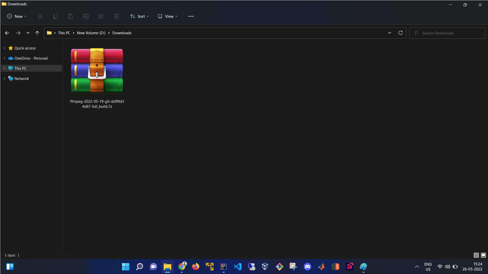
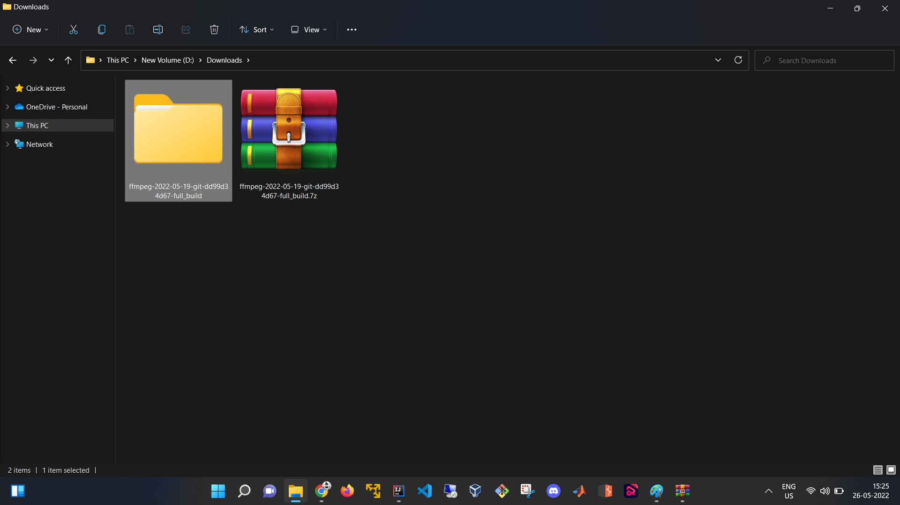
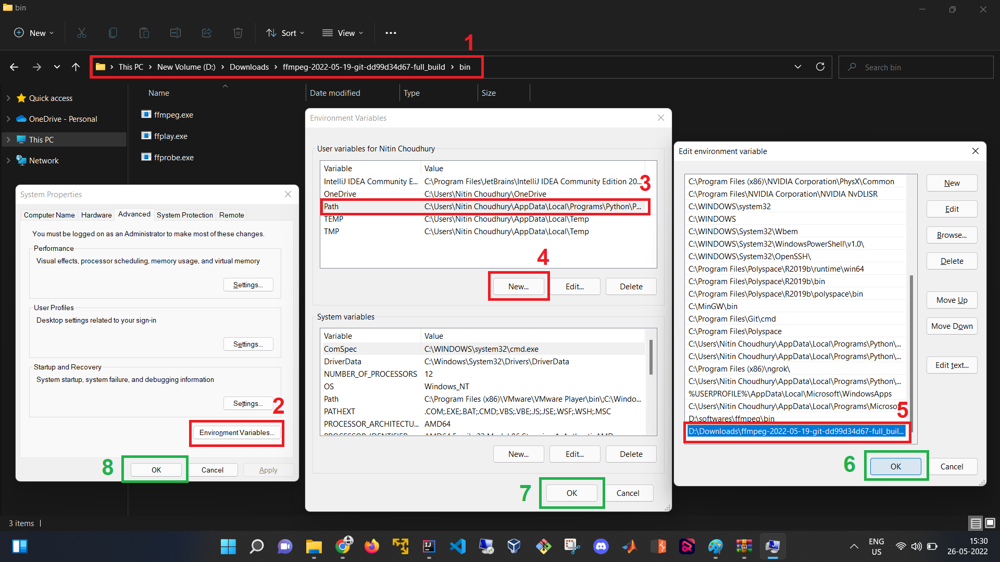

# GenreDetector

A project on detection of Genre of music using Neural Network.


## Dataset Structure
```
<Dataset>
    |
    |--> <Genre 1>
    |        |--> <G1 Audio 1>
    |        |--> <G1 Audio 2>
    |
    |--> <Genre 2>
    |        |--> <G2 Audio 1>
    |        |--> <G2 Audio 2>
    |
    |-> <Genre 3>
             |--> <G3 Audio 1>
             |--> <G3 Audio 2>

```


## Usage

#### **STEP 1: Install Requirements**
```
$ python3 -m pip install -r requirements.txt
```

#### **STEP 2: Install FFmpeg**

> ##### For Windows OS

* Download FFmpeg from [here](https://github.com/GyanD/codexffmpeg/releases/download/2022-05-23-git-6076dbcb55/ffmpeg-2022-05-23-git-6076dbcb55-full_build.7z).



* Extract the files.



* Set Environ Path to the binary folder of the extracted files.



 * Copy the path of the "bin" directory from the extracted files [Figure: (1)].
 * Open System Properties from control panel and click on "Environment Variables" [Figure: (2)].
 * Now select the "Path" [Figure: (3)] and then click on "New" [Figure: (4)].
 * Now browse or paste the "bin" directory path [Figure: (5)] and hit "OK" for all the tabs [Figure: (6, 7, 8)].

> ##### For Linux Based OS
```
$ sudo apt-get update
$ sudo apt-get install ffmpeg 
```

#### **STEP 3: PREPARE DATASET**

```
$ python3 prepare_dataset.py -d <Dataset> -s <no of segments per audio> -o <Output JSON File>
```

#### **STEP 3: TRAIN CNN MODEL**

```
$ python3 trainCNN.py -d <Output JSON File> --test <test dataset size [eg. 0.1]> --valid <validation dataset size [eg. 0.1]> -b <batch size> -e <no. of epochs> -o <Output model [eg. model.h5]>
```

#### **STEP 3: PREDICT**

```
$ python3 predict.py -m <model directory or file> -a <audio file>
```

